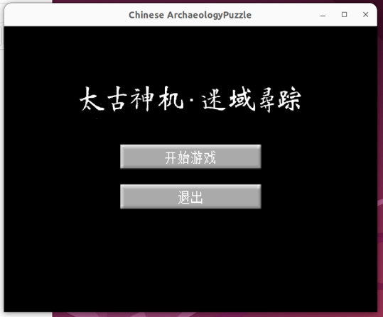
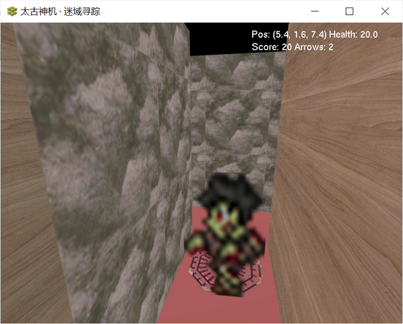
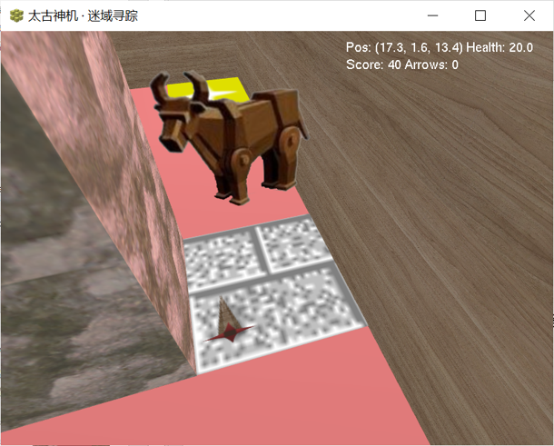
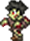
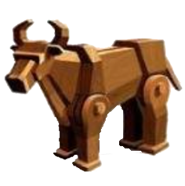
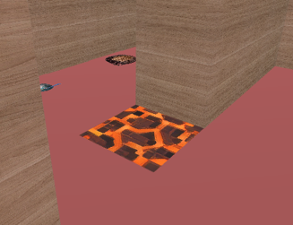

**The English introduction is shown below the Chinese version.**

## 0.总体玩法
本游戏是一款场景动作游戏，分为3个关卡，玩家需要在每个关卡中收集物资、击败敌人，获得分数，并进入下一关，最后击杀Boss通关整个游戏。  
游戏现已登陆Windows和Linux(Ubuntu)等平台。  
另外，玩家可自行定制游戏中的关卡和贴图，设计自己的MOD。  

## 1.技术选型

游戏应用现代C++，以OpenGL实现图形渲染， stb image库实现加载纹理图像，IDE使用VSCode。  
用编译器gcc/MinGW实现了跨平台，兼容Windows和Linux，如Windows上使用PlaySound API，Linux使用dr wav播放声音。  

**MVC架构**

模型(Model)：处理游戏逻辑，如敌人寻路、攻击、伤害、拾取物品等。
视图(View)：调用OpenGL库实现场景渲染。
控制器(Controller)：处理玩家的输入，如将键盘输入传送给模型部分，并管理单个游戏关卡的开始和结束。

**算法实现**

- 敌人寻路部分应用A\*算法（时间复杂度O(m*n)，m、n为迷宫长、宽）
- 判断敌人是否已经看到玩家的部分使用Bresenham算法（O(m+n)）
- 渲染墙壁部分每行/每列扫描整个二维数组地图，找出墙壁边界位置，避免重复渲染墙壁内部（时间复杂度O(m*n)）

## 2.游戏截图

开始界面：  


僵尸（普通敌怪）：  


木牛流马（Boss）：  


## 3. 快捷键
按W,A,S,D移动，拖动鼠标或按↑,↓,←,→键转动视角，按e键近战攻击，按q键远程攻击（投掷箭），按空格键跳跃。  

## 4.玩家、敌怪和Boss
### (1) 玩家
玩家拥有20最大生命值，2.5m/s的移动速度，0.6m宽的碰撞箱。

### (2) 僵尸
  
作为游戏唯一的普通敌怪，僵尸拥有20生命值、1.2m/s的移动速度，发现玩家后，会寻找和追踪玩家，距离玩家1.2m时会近战攻击玩家，造成3的伤害。  
如果玩家逃离僵尸的视线，僵尸依然会继续追踪玩家，直到玩家死亡或到达了僵尸不可达的位置（如穿过了上升柱装置）。  
僵尸死亡后给予基础得分奖励3倍（30）的得分。  

### (3) 木牛流马
  
木牛流马是游戏的关底Boss，玩家必须击败木牛流马才能通关游戏。  
木牛流马具有25生命值，每隔2s向玩家发射一支箭，击中玩家时造成8的伤害，玩家可以通过左右移动避开正前方射来的箭。  
木牛流马死亡后给予基础得分奖励3倍（30）的得分。  

## 5. 物品和装置
### (1) 古代遗器
古代遗器有浑天仪、司南、钟、香炉和算盘五种形态，玩家拾取后获得10的得分。  

### (2) 葫芦
葫芦作为生命恢复装置，每个葫芦饮用后恢复2生命值，最多恢复到最大生命值（20），当生命值已满时葫芦无法饮用。  
仅玩家可以拾取葫芦。

### (3) 上升柱
上升柱外观为灰色，玩家通过之后会在上升柱位置升起墙壁，阻碍后方的敌人到达玩家。玩家通过之后，获得10的得分。  
上升柱目前只在关底Boss的房间门口出现，一经升起不可重新下降。  

### (4) 岩浆陷阱
  
岩浆陷阱外观为橙色，玩家和敌人站上后每游戏刻会受到1的伤害，但受击后伤害免疫会将实际伤害减少到每0.5秒一次。  

## 6. 游戏机制细节
### (1) 游戏刻
游戏的每游戏刻为0.05s，默认最大帧率为60 fps。每个游戏刻会执行计算玩家、敌人和其他实体的逻辑，并移除不必要的实体。  

### (2) 受击后伤害免疫
灵感来源于[Minecraft Wiki](https://zh.minecraft.wiki/w/%E5%8F%97%E5%87%BB%E5%90%8E%E4%BC%A4%E5%AE%B3%E5%85%8D%E7%96%AB)，玩家/敌人受到伤害之后，免疫时间会被设为10游戏刻（0.5秒），并记录伤害值为上次伤害值。免疫时间内，玩家/敌人外观呈红色。  
免疫时间内受到新的 伤害值≤上次伤害值的伤害时，伤害不会生效。  
如果新的 伤害值＞上次伤害值，上次伤害值会设置为新的伤害值，实际生效的伤害是 新伤害值-上次伤害值。  
如玩家首先受到了3的僵尸攻击伤害，0.5s内又受到了箭的8伤害，箭的实际伤害会变成8-3=5。  

## 7. 定制/MOD
### (1) 关卡定制
游戏当前工作路径下的mapsList.txt的每行包含一个地图文件的相对/绝对路径，按关卡顺序排列。玩家可通过修改mapsList.txt自定义新的关卡。  
每个关卡文件（如gamemap1.txt）开头的数字分别是当前关的基础得分奖励（默认为10），和当前关随机生成的僵尸数量。  
文件内容部分是关卡地图的网格，每格的含义详见源文件[scene.h](scene.h)的`enum class Cell`部分。  
如第一关的游戏地图：  
```
10 1
P _ _ _ P W W W W P
_ S _ 2 W W W W W W
_ _ W _ R _ W _ W W
_ _ W _ W W W R W W
P _ W _ W _ r _ W P
W o W _ W _ W _ W W
W 4 W o _ R W _ L W
W W W W W W W 4 L L
W _ R _ _ _ _ _ _ D
P W W L P L L L L P
```

### (2) 贴图/音效定制
游戏使用的贴图和音效资源文件存放在游戏工作路径的res目录下，玩家可自行替换这些文件，但需注意文件名相同（在Linux版本中，文件大小写也要相同）。  

---

## 0. Gameplay Overview
This is a scene-based action game divided into 3 levels. Players need to collect supplies, defeat enemies, earn points in each level, then proceed to the next level, ultimately defeating the Boss to complete the game.  
The game is now available on Windows and Linux (Ubuntu) platforms.  
Additionally, players can customize levels and textures to create their own MODs.  

## 1. Technical Implementation

The game uses modern C++ with OpenGL for graphics rendering and stb_image library for texture loading, developed in VSCode IDE.  
Cross-platform compatibility (Windows/Linux) is achieved through gcc/MinGW compilers, implementing platform-specific solutions like PlaySound API for Windows and dr_wav for Linux audio playback.  

**MVC Architecture**  

Model: Handles game logic including enemy pathfinding, attacks, damage calculation, and item collection.  
View: Implements scene rendering using OpenGL.  
Controller: Processes player inputs (keyboard/mouse), relays commands to the model, and manages level transitions.  

**Algorithms**  

- A\* algorithm for enemy pathfinding (Time complexity: O(m*n) for maze dimensions m×n)  
- Bresenham's algorithm for enemy vision detection (O(m+n))  
- Optimized wall rendering by scanning 2D map arrays to identify boundary edges, avoiding redundant inner-wall rendering (O(m*n))  

## 2. Screenshots

Main Menu:  
  

Zombie (Standard Enemy):  
  

Wooden Ox (Boss):  
  

## 3. Controls
WASD for movement, mouse drag or arrow keys for camera rotation, E for melee attack, Q for ranged attack (arrow throw), Space to jump.  

## 4. Player, Enemies and Boss
### (1) Player
20 max HP, 2.5m/s movement speed, 0.6m-wide collision box.  

### (2) Zombie
  
As the standard enemy, zombies have 20 HP and 1.2m/s speed. They pursue players upon detection, dealing 3 damage via melee attacks within 1.2m range.  
Zombies continue chasing even after losing visual contact until either the player dies or becomes unreachable (e.g., via rising pillar mechanisms).  
Defeating a zombie grants 3× base score (30 points).  

### (3) Wooden Ox (Muniuliuma)
  
The final Boss that must be defeated to complete the game.  
With 25 HP, it shoots arrows every 2 seconds (8 damage per hit). Players can dodge by sidestepping.  
Defeating it grants 3× base score (30 points).  

## 5. Items and Mechanisms
### (1) Ancient Artifacts
Five types (armillary sphere, compass, clock, incense burner, abacus). Collecting any grants 10 points.  

### (2) Gourd
Restores 2 HP (up to max 20). Unusable at full health. Player-exclusive.  

### (3) Rising Pillar
Gray-colored. After player passage, walls rise to block pursuing enemies. Grants 10 points.  
Currently only appears before Boss rooms. Walls remain permanently raised.  

### (4) Magma Trap
  
Orange-colored. Inflicts 1 damage per game tick (0.05s) to any standing entity, with damage immunity reducing effective damage to once per 0.5s.  

## 6. Game Mechanics
### (1) Game Tick
Each tick lasts 0.05s (default 60 fps max). Processes entity logic and removes unnecessary entities per tick.  

### (2) Post-Hit Immunity  
Inspired by [Minecraft Wiki](https://minecraft.wiki/w/Damage#Invulnerability_timer), entities gain 10-tick (0.5s) immunity after taking damage, shown as red tint.  
During immunity:  
- New damage ≤ previous damage: Negated  
- New damage > previous damage: Net damage = (new - previous), updating stored damage value  
Example: If 3 damage (zombie) is followed by 8 damage (arrow) within 0.5s, net arrow damage becomes 5.  

## 7. Customization/MODs
### (1) Level Design
Edit mapsList.txt in the working directory, listing map file paths in level order.  
Map files (e.g., gamemap1.txt) begin with:  
- Base score (default: 10)  
- Random zombie count  

Followed by grid data (see [scene.h](scene.h) `enum class Cell` for tile meanings).  
For example, the in-game level 1 map is:  
```
10 1
P _ _ _ P W W W W P
_ S _ 2 W W W W W W
_ _ W _ R _ W _ W W
_ _ W _ W W W R W W
P _ W _ W _ r _ W P
W o W _ W _ W _ W W
W 4 W o _ R W _ L W
W W W W W W W 4 L L
W _ R _ _ _ _ _ _ D
P W W L P L L L L P
```

### (2) Texture/Sound Modding
Replace the files in `/res` directory while preserving filenames (case-sensitive on Linux).  